# Tarea 1: Machine Learning

Autor: Alejandro Borrego Megías  
Correo: alejbormeg@gmail.com

## Índice
0. [Introducción](#introducción)
1. [Análisis Exploratorio y Limpieza de Datos](#análisis-exploratorio-y-limpieza-de-datos)
2. [Mejor Modelo de Regresión Logística](#mejor-modelo-de-regresión-logística)
   - [Justificación de Parametrizaciones](#justificación-de-parametrizaciones)
   - [Mejor Red Neuronal Basada en Regresión Logística](#mejor-red-neuronal-basada-en-regresión-logística)
3. [Selección de Variables y Mejor Red Neuronal en Términos de AUC](#selección-de-variables-y-mejor-red-neuronal-en-términos-de-auc)
   - [Justificación de Parametrizaciones](#justificación-de-parametrizaciones-1)
4. [Comparación de Modelos](#comparación-de-modelos)
5. [Mejor Búsqueda Paramétrica para Árboles de Decisión](#mejor-búsqueda-paramétrica-para-árboles-de-decisión)
   - [Representación Gráfica del Árbol Ganador](#representación-gráfica-del-árbol-ganador)
   - [Importancia de las Variables](#importancia-de-las-variables)
6. [Mejor Modelo de Bagging y Random Forest](#mejor-modelo-de-bagging-y-random-forest)
7. [Mejor Modelo de Gradiente Boosting y XGBoost](#mejor-modelo-de-gradiente-boosting-y-xgboost)
8. [Mejor Modelo de SVM con Diferentes Kernels](#mejor-modelo-de-svm-con-diferentes-kernels)
9. [Método de Ensamblado de Bagging](#método-de-ensamblado-de-bagging)
10. [Método de Stacking](#método-de-stacking)
11. [Conclusiones](#conclusiones)

## Introducción

En este informe, exploraremos el conjunto de datos proporcionado con el objetivo de clasificar en la categorías "presenta obseidad" (1) "no presenta obesidad" (0). Para este análisis utilizaremos un conjunto de datos que incluye variables como género, edad, altura, peso, historial familiar de sobrepeso, hábitos alimenticios y de actividad física, entre otros, para desarrollar modelos predictivos precisos.

Comenzaremos con un análisis exploratorio y limpieza de los datos para comprender mejor su estructura y calidad, abordando cualquier anomalía, valor faltante o atípico que pueda afectar la precisión de nuestros modelos. Este paso es fundamental para garantizar la integridad de nuestros análisis posteriores. Además las técnicas que se usarán en los siguientes apartados precisan de este análisis previo en su mayoría, por ello para no repetirnos lo realizaremos una sola vez.

Posteriormente, buscaremos el mejor modelo de regresión logística, analizando las variables más influyentes y, a partir de estas, desarrollaremos una red neuronal optimizada en términos de precisión. Este enfoque nos permitirá explorar la complejidad de las relaciones entre variables y su impacto en la clasificación de la obesidad.

Además, aplicaremos técnicas de selección de variables para identificar los predictores más significativos y, con ellos, entrenar un modelo de red neuronal enfocado en maximizar el Área Bajo la Curva (AUC) de la característica operativa del receptor (ROC), crucial para evaluar el rendimiento en tareas de clasificación.

Compararemos estos modelos para identificar el más adecuado para nuestra tarea. También realizaremos búsquedas paramétricas exhaustivas para optimizar modelos de árboles de decisión, bagging, random forest, gradiente boosting, XGBoost y máquinas de vectores de soporte (SVM) con diferentes kernels, buscando siempre la máxima precisión.

Exploraremos métodos de ensamblaje avanzados como Bagging con clasificadores base no tradicionales y Stacking, integrando múltiples algoritmos para mejorar la robustez y precisión de nuestras predicciones.

Este análisis nos permitirá no solo identificar el mejor modelo para clasificar la obesidad basándonos en características individuales, sino también proporcionar insights valiosos sobre la relación entre el estilo de vida, características personales y el riesgo de obesidad. La precisión y eficacia de nuestros modelos tienen el potencial de informar intervenciones dirigidas y políticas de salud pública para combatir la obesidad a nivel individual y comunitario.

## Análisis Exploratorio y Limpieza de Datos

(Descripción del análisis exploratorio de los datos, incluyendo estadísticas descriptivas, visualizaciones para comprender la distribución de los datos y la identificación de valores atípicos o faltantes. Detalle del proceso de limpieza de datos, incluyendo la imputación de valores faltantes, la eliminación de valores atípicos y cualquier transformación de variables realizada).

Los datos que usaremos se encuentran en el fichero *src\data\datos_practica_miss.csv*. Para leerlos usaremos la librería *pandas* de Python para cargarlos como un dataframe, tras esto usaremos la semilla *4579* (últimos dígitos de mi DNI) para tomar una muestra aleatoria de 1000 filas y realizamos una primera exploración de los datos con la función *info*:

```py
data = pd.read_csv("C:\\Users\\pablo\\OneDrive\\Documentos\\GitHub\\MasterBigDataML-MachineLearningI\\src\\data\\datos_practica_miss.csv")

data = data.sample(n=1000, random_state=4975)
data.info()
```

```bash
<class 'pandas.core.frame.DataFrame'>
Index: 1000 entries, 371 to 1382
Data columns (total 18 columns):
 #   Column                          Non-Null Count  Dtype  
---  ------                          --------------  -----  
 0   Unnamed: 0                      1000 non-null   int64  
 1   Gender                          983 non-null    object 
 2   Age                             977 non-null    float64
 3   Height                          975 non-null    float64
 4   Weight                          977 non-null    float64
 5   family_history_with_overweight  976 non-null    object 
 6   FAVC                            975 non-null    object 
 7   FCVC                            977 non-null    float64
 8   NCP                             973 non-null    float64
 9   CAEC                            975 non-null    object 
 10  SMOKE                           984 non-null    object 
 11  CH2O                            980 non-null    float64
 12  SCC                             981 non-null    object 
 13  FAF                             973 non-null    float64
 14  TUE                             981 non-null    float64
 15  CALC                            981 non-null    object 
 16  MTRANS                          980 non-null    object 
 17  NObeyesdad                      980 non-null    object 
dtypes: float64(8), int64(1), object(9)
```
Dentro del contexto del estudio sobre obesidad, cada variable recogida en los datos juega un papel importante en el análisis. A continuación, se explica el significado de cada una de estas variables:

1. Gender: Esta variable es de tipo objeto y representa el género del individuo, con 983 valores no nulos registrados. Los géneros típicamente se clasifican como masculino o femenino, pero el diseño del estudio podría incluir otras categorías según cómo se recolectaron los datos.

2. Age: Representa la edad de los individuos, con 977 valores no nulos. Se registra como un número de punto flotante, lo que permite incluir edades exactas hasta cierto nivel decimal (aunque usualmente la edad se maneja en números enteros).

3. Height: La altura de los individuos, registrada para 975 sujetos como un número de punto flotante. Esta medida es crucial para evaluar el Índice de Masa Corporal (IMC) junto con el peso.

4. Weight: El peso de los individuos, disponible para 977 sujetos, también como un número de punto flotante. Es uno de los factores clave para determinar el estado nutricional y el riesgo de obesidad.

5- family_history_with_overweight: Indica si el individuo tiene antecedentes familiares de sobrepeso, con 976 respuestas. Es una variable de tipo objeto, probablemente con respuestas como "sí" o "no", que ayuda a entender la predisposición genética o ambiental hacia la obesidad.

6. FAVC: "Frecuencia de Consumo de Alimentos Altos en Calorías" (High-Calorie Food Consumption Frequency), registrada para 975 individuos como objeto, indica si el individuo consume frecuentemente alimentos altos en calorías, un factor importante en el riesgo de obesidad.

7. FCVC: "Frecuencia de Consumo de Verduras", con 977 valores no nulos, mide la regularidad con la que el individuo consume verduras, contribuyendo a evaluar la calidad de la dieta.

8. NCP: "Número de Comidas Principales", con datos para 973 individuos, registra cuántas comidas principales hace la persona al día, importante para entender los patrones alimenticios.

9. CAEC: "Consumo de Alimentos Entre Comidas", con 975 valores no nulos, indica la frecuencia con la que la persona consume snacks o alimentos fuera de las comidas principales, lo cual puede afectar el balance calórico total.

10. SMOKE: Indica si el individuo fuma, con datos para 984 personas. Fumar puede influir en el metabolismo y en el apetito, afectando indirectamente el peso.

11. CH2O: La cantidad de agua consumida diariamente, registrada para 980 sujetos. Una adecuada hidratación puede influir en la digestión, el metabolismo y la sensación de saciedad.

12. SCC: "Monitoreo de Calorías Consumidas", con 981 valores, indica si el individuo lleva un control sobre las calorías que consume, lo cual puede ser indicativo de una mayor conciencia y gestión del peso.

13. FAF: "Frecuencia de Actividad Física", registrada para 973 individuos, refleja cuán a menudo la persona realiza ejercicio, crucial para el manejo del peso y la salud general.

14. TUE: "Tiempo Usado en Dispositivos Electrónicos", con datos para 981 individuos, puede indicar niveles de sedentarismo, afectando el balance energético y el riesgo de obesidad.

15. CALC: "Consumo de Alcohol", con 981 respuestas, refleja la frecuencia con la que el individuo consume bebidas alcohólicas, las cuales pueden contribuir a un exceso de calorías.

16. MTRANS: "Medio de Transporte", registrado para 980 individuos, indica el método principal de movilidad del individuo (por ejemplo, caminar, transporte público, automóvil), lo que puede influir en el nivel de actividad física diaria.

Cada una de estas variables ofrece una vista comprensiva sobre diferentes aspectos que pueden influir en el peso y la salud de una persona, permitiendo un análisis detallado sobre los factores de riesgo y las potenciales intervenciones para prevenir o manejar la obesidad.

A simple vista destaca la presencia de valores perdidos en la mayoría de columnas a excepción de la columna "Unnamed: 0", que eliminaremos por no conocer la relación de dicha columna con el problema.

Para conocer el significado de las siguientes categorías se ha realizado una búsqueda por internet llegando a las siguientes conclusiones:


### Valores atípicos
En un primer lugar veremos la presencia de valores atípicos en los datos y si se deben tratar como datos perdidos.

Realizamos un *Boxplot* por cada columna numérica:

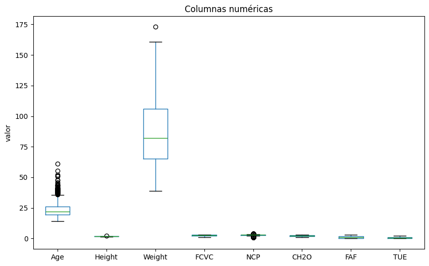

Vemos como hay valores atípicos en la columna de la edad (los cuales no podemos considerar como valores perdidos, pues debe de tratarse de la edad real de ciertas personas encuestadas, que en su mayoría son jóvenes de entre 20 y 27 años). Lo mismo haremos con los datos atípicos de las columnas de la altura, peso y NCP pues se tratan de valores dentro de la normalidad, aunque atípicos en este caso.


### Valores perdidos
Contamos el total de valores perdidos por columna:

```py
data.isna().sum()
```

```bash
Unnamed: 0                         0
Gender                            17
Age                               23
Height                            25
Weight                            23
family_history_with_overweight    24
FAVC                              25
FCVC                              23
NCP                               27
CAEC                              25
SMOKE                             16
CH2O                              20
SCC                               19
FAF                               27
TUE                               19
CALC                              19
MTRANS                            20
NObeyesdad                        20
```

Comprobamos también que en este caso no tenemos filas duplicadas.

Vemos como en ningún caso tenemos una cantidad extrema de valores perdidos como para considerar eliminar alguna columna del estudio.

Vamos a visualizar estos datos perdidos con ayuda de la librería *missingno* de python, para ver si la mayoría de valores perdidos caen juntos en la mismas filas, y considerar eliminarlas:

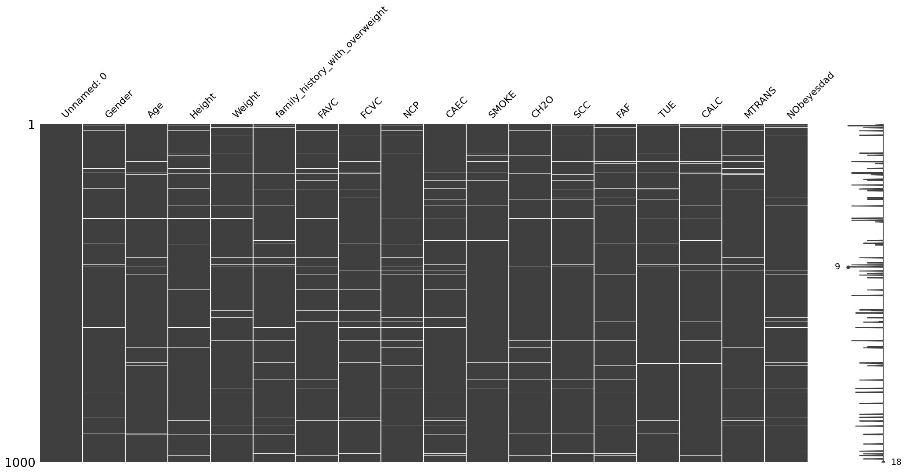

En primer lugar eliminamos los valores perdidos de la variable objetivo "NObeyesdad". Pues no tiene sentido imputarlos.

La distribución de valores eprdidos es muy aleatoria dentro de cada columna, por ello optamos por imputar los valores perdidos, sustituyendo las variables numéricas por la media o mediana (dependiente de si son o no simétricas) y las categóricas por la moda. Eliminamos también la primera columna por ser irrelevante para el estudio:

```py
data.drop('Unnamed: 0', axis=1, inplace=True)
data = data.dropna(subset=['NObeyesdad'])


for column in numerical_columns:
    if abs(skew(data[column].dropna())) > 1:
        data[column].fillna(data[column].median(), inplace=True)
    else:
        data[column].fillna(data[column].mean(), inplace=True)


for column in categorical_columns:
    data[column].fillna(data[column].mode()[0], inplace=True)

data.isnull().sum()
```
Con esto comprobamos cómo hemos eliminado todos los valores perdidos: 

```bash
Gender                            0
Age                               0
Height                            0
Weight                            0
family_history_with_overweight    0
FAVC                              0
FCVC                              0
NCP                               0
CAEC                              0
SMOKE                             0
CH2O                              0
SCC                               0
FAF                               0
TUE                               0
CALC                              0
MTRANS                            0
NObeyesdad                        0
```

### Transformación en variable objetivo
La variable objetivo del problema es la columna "NObeyesdad", que como vemos presenta diferentes categorías:
* Obesity_Type_I
* Obesity_Type_II
* Obesity_Type_III
* Overweight_Level_I
* Overweight_Level_II
* Normal_Weight
* Insufficient_Weight

Dado que el problema que pretendemos resolver es un problema de clasificación **Binaria** debemos cambiar esta columna por valores numéricos 0 (si no presenta obesidad) y 1 (si presenta obesidad). A continuación mostramos la distribución de las diferentes etiquetas:

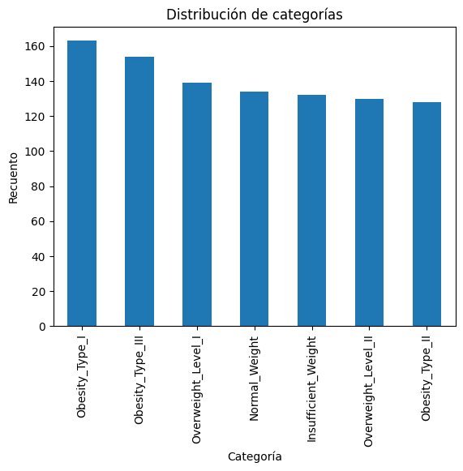

Como vemos todas ellas presentan una cantidad similar de valores, el mappeo que realizaremos en la columna es el siguiente:

```py
obesity_mapping = {
    'Obesity_Type_I': 1,
    'Obesity_Type_II': 1,
    'Obesity_Type_III': 1,
    'Overweight_Level_I': 0,
    'Overweight_Level_II': 0,
    'Normal_Weight': 0,
    'Insufficient_Weight': 0
}

data['NObeyesdad'] = data['NObeyesdad'].map(obesity_mapping)
data['NObeyesdad'].value_counts()
```

Obteniendo un total de 535 no obesos y 445 con obesidad. En futuras secciones trataremos de obtener una representación similar de valores positivos y negativos en las particiones que usemos para entrenamiento y test.

### Eliminación de variables
Finalmente, de cara a los modelos lineales estudiaremos la correlación entre las variables numéricas para comprobar si se debería eliminar alguna:

```py
matriz_corr = correlation.corr(method = 'pearson')
mask = np.triu(np.ones_like(matriz_corr, dtype=bool))
plt.figure(figsize=(10, 8))
sns.heatmap(matriz_corr, annot=True, cmap='coolwarm', linewidths=0.5, mask=mask)
sns.set(font_scale=1.2)
plt.title("Matriz de correlación")
plt.show()
```
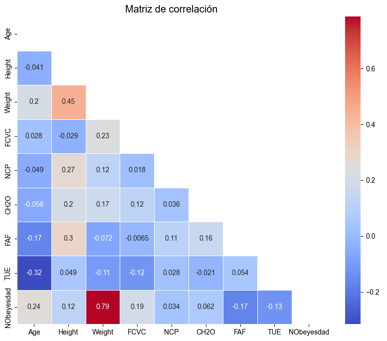


## Mejor Modelo de Regresión Logística

Utilizando la librería `sklearn`, implementamos un modelo de Regresión Logística optimizado con un exhaustivo proceso de selección de hiperparámetros a través de `GridSearchCV`. Este modelo es ideal para problemas de clasificación binaria, donde nuestro objetivo es determinar la presencia o ausencia de obesidad en individuos.

### Preprocesamiento:

El paso crítico antes del entrenamiento fue el preprocesamiento de datos, esencial para adecuar nuestras variables a los modelos de aprendizaje automático. Empleamos `ColumnTransformer` para:

- **Variables Numéricas**: Escaladas con `MinMaxScaler` para normalizar cada característica en el rango [0, 1], facilitando el proceso de aprendizaje y optimización.
  
- **Variables Categóricas**: Convertidas a formato numérico mediante `OneHotEncoder`, permitiendo que los modelos matemáticos procesen eficientemente etiquetas categóricas.

### Definición del Modelo y Selección de Características:

Definimos `logistic_regression` como nuestro modelo base y preparamos un conjunto de datos con características seleccionadas usando `SequentialFeatureSelector` de `mlxtend`, optando por un enfoque stepwise que considera tanto la adición como la eliminación de características:

```python
from mlxtend.feature_selection import SequentialFeatureSelector as SFS
logistic_regression = LogisticRegression(max_iter=5000)

# Configuramos la selección secuencial stepwise
sfs = SFS(estimator=logistic_regression, 
          k_features='best', 
          forward=True, 
          floating=True,  # Habilita la selección stepwise
          scoring='accuracy',
          cv=StratifiedKFold(5))

# Entrenamos el modelo con los datos preprocesados
sfs.fit(X_train_preprocessed, y_train)
```
Con este método realizamos la selección de variables para el entrenamiento del modelo.

### Búsqueda en Malla para Optimización de Hiperparámetros:

Con el objetivo de afinar el modelo, definimos un param_grid amplio para GridSearchCV:

```py
param_grid = {
    'C': [0.001, 0.01, 0.1, 1, 10, 100, 1000],
    'solver': ['newton-cg', 'lbfgs', 'liblinear', 'sag', 'saga'],
    'penalty': ['l2', 'l1', 'elasticnet', 'none'],
    'class_weight': [None, 'balanced'],
    'max_iter': [100, 1000, 5000, 10000]
}
```

Dónde:
    
* **'C'**: Es el parámetro de inversión de la fuerza de regularización. Valores más bajos especifican una regularización más fuerte, lo que puede prevenir el sobreajuste reduciendo la complejidad del modelo, pero también puede causar un subajuste al no permitir que el modelo se ajuste suficientemente a los datos. El rango va desde 0.001 a 1000, lo que permite explorar desde una regularización muy fuerte a una muy débil.

* **'solver'**: Especifica el algoritmo a usar en el problema de optimización. Cada solucionador tiene sus propias características y es adecuado para tipos específicos de datos:

    * 'newton-cg', 'lbfgs', 'sag' y 'saga' son buenos para datasets grandes o cuando se requiere regularización L2, aunque los exploraremos igualmente.

    * 'liblinear' es una buena elección para datasets pequeños y soporta la regularización L1.

    * 'saga' también soporta la regularización "elasticnet" y es la única opción para este tipo de regularización.

* **'penalty'**: Se refiere al tipo de penalización o regularización a aplicar. La regularización ayuda a prevenir el sobreajuste y mejora la generalización del modelo. Las opciones son:
    * 'l2' es la penalización estándar que se aplica por defecto.
    * 'l1' es útil para generar modelos más simples o cuando se sospecha que algunas características pueden ser irrelevantes.
    * 'elasticnet' es una combinación de L1 y L2, proporcionando un equilibrio entre generar un modelo simple (L1) y mantener la regularización de modelos más complejos (L2).
    * 'none' indica que no se aplica ninguna regularización.

* **'class_weight'**: Este parámetro se usa para manejar desequilibrios en las clases. Al ajustar este parámetro, se puede influir en la importancia que el modelo da a cada clase durante el entrenamiento:
    * None significa que todas las clases tienen el mismo peso.
    * 'balanced' ajusta automáticamente los pesos inversamente proporcionales a las frecuencias de clase en los datos de entrada, lo que puede ser útil para datasets desequilibrados.

* **'max_iter'**: Especifica el número máximo de iteraciones tomadas para que los solucionadores converjan a una solución. Un número más alto de iteraciones permite más tiempo para que el modelo encuentre una solución óptima, pero también aumenta el tiempo de computación. Se exploran varios valores para asegurar que el solucionador converge adecuadamente para diferentes complejidades de modelos.

```py
# Reducimos los conjuntos a las características seleccionadas y aplicamos GridSearch
X_train_selected = X_train_preprocessed[:, sfs.k_feature_idx_]
X_test_selected = X_test_preprocessed[:, sfs.k_feature_idx_]
grid_search = GridSearchCV(estimator=logistic_regression, param_grid=param_grid, cv=StratifiedKFold(5), scoring='accuracy')
grid_search.fit(X_train_selected, y_train)
```

Los parámetros óptimos obtenidos fueron `{'C': 1, 'class_weight': None, 'max_iter': 100, 'penalty': 'l1', 'solver': 'liblinear'}` y la precisión alcanzada con el modelo ajustado fue de 0.98 aproximadamente, demostrando una excelente capacidad predictiva. Las características finales seleccionadas reflejan aspectos importantes tanto biológicos como relacionados con el estilo de vida que afectan la probabilidad de obesidad.

La matriz de confusión obtenida es la siguiente:


### Mejor Red Neuronal Basada en Regresión Logística

Para construir la mejor red neuronal basada en las características seleccionadas por el modelo de regresión logística, utilizamos un enfoque sistemático para explorar una variedad de configuraciones de red neuronal. Este proceso se llevó a cabo mediante la implementación de *MLPClassifier* de Scikit-learn, junto con *GridSearchCV* para una búsqueda exhaustiva de hiperparámetros óptimos, garantizando así la selección de la configuración más adecuada para nuestro conjunto de datos.

La elección de características se basó en las seleccionadas por SequentialFeatureSelector, que identificó las variables más relevantes de acuerdo con su impacto en la precisión de la regresión logística. Estas características se utilizaron como entrada para entrenar la red neuronal, asegurando que el modelo se centrara solo en los predictores más significativos.

El param_grid_nn definido para GridSearchCV incluyó una gama de opciones para la arquitectura de la red y sus parámetros:

* **'hidden_layer_sizes'**: Exploramos varias configuraciones de capas ocultas, desde una sola capa de 50 o 100 neuronas hasta dos capas de 50 o 100 neuronas cada una. Esta variedad permite evaluar cómo la profundidad y la complejidad de la red afectan su rendimiento.

* **'activation'**: Se probó con funciones de activación 'tanh' y 'relu', para determinar cuál facilita mejor la convergencia y la capacidad de generalización del modelo.

* **'solver'**: Incluimos 'sgd' para el descenso de gradiente estocástico y 'adam', un optimizador basado en gradientes estocásticos más sofisticado, para identificar el algoritmo de optimización más efectivo.

* **'alpha'**: Se varió el término de regularización para prevenir el sobreajuste, evaluando desde una regularización fuerte a una más ligera.

* **'learning_rate'**: Se consideraron estrategias 'constant' y 'adaptive', esta última ajusta la tasa de aprendizaje a lo largo del entrenamiento para mejorar la eficiencia y la convergencia.

Tras el proceso de entrenamiento y validación mediante GridSearchCV, el modelo resultante alcanzó una precisión de 0.9694, un indicador de su excelente capacidad predictiva. Los mejores parámetros identificados para la red neuronal fueron:

* Activación: 'tanh', que sugiere que esta función de activación funciona bien con nuestro conjunto de datos, posiblemente ayudando a evitar problemas de gradientes que desaparecen en comparación con 'relu' en este contexto específico.

* Regularización alpha: 0.001, proporcionando un balance óptimo entre aprendizaje y prevención del sobreajuste.

* Tamaño de las capas ocultas: (50, 50), lo que indica que una red de dos capas con 50 neuronas cada una es suficiente para capturar la complejidad de nuestros datos sin incurrir en sobreajuste.

* Tasa de aprendizaje: 'constant', demostrando que mantener una tasa de aprendizaje constante a lo largo del entrenamiento es efectivo para este modelo.

* Solucionador: 'adam', confirmando que este optimizador es adecuado para nuestros datos, probablemente debido a su eficiencia en conjuntos de datos relativamente pequeños y su capacidad para manejar bien los mínimos locales.

Este enfoque metodológico y la selección cuidadosa de hiperparámetros han permitido desarrollar un modelo de red neuronal robusto y preciso, basado en los predictores clave identificados a través de la regresión logística, para predecir la obesidad en individuos.

La matriz de confusión obtenida es la siguiente:

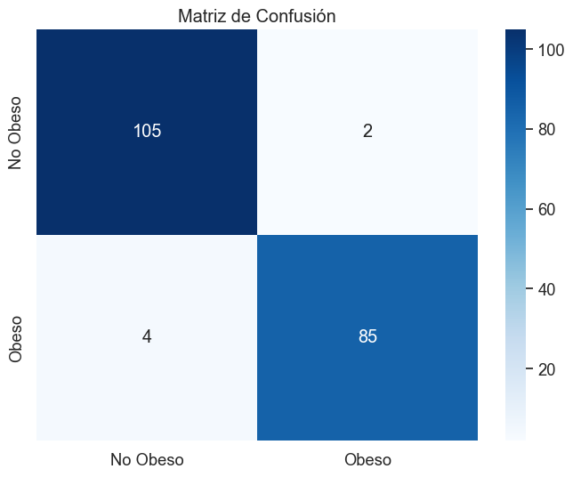

## Selección de Variables (Select K=4 Best) y Mejor Red Neuronal en Términos de AUC

### Justificación de Parametrizaciones

En nuestro proceso de modelado, nos enfocamos en optimizar tanto la selección de variables como la configuración de nuestra red neuronal para maximizar el Área Bajo la Curva ROC (AUC), un indicador clave de la capacidad del modelo para distinguir entre clases en problemas de clasificación.
Selección de Variables

Para la selección de variables, utilizamos SelectKBest con el criterio f_classif, como se muestra en el fragmento de código a continuación:

```py
from sklearn.feature_selection import SelectKBest, f_classif

# Definir el selector de características con k=4
selector = SelectKBest(f_classif, k=4)
```
Esta técnica evalúa la importancia de cada característica mediante pruebas estadísticas ANOVA, seleccionando las 4 más relevantes. La elección de k=4 se basó en análisis preliminares que sugerían una combinación óptima de características para nuestro modelo.
Optimización de la Red Neuronal

La red neuronal se configuró y optimizó usando MLPClassifier y GridSearchCV para explorar un amplio espacio de parámetros:

```py
from sklearn.neural_network import MLPClassifier
from sklearn.model_selection import GridSearchCV
from sklearn.metrics import make_scorer, roc_auc_score
from sklearn.pipeline import Pipeline

mlp = MLPClassifier(max_iter=1000)
param_grid = {
    'mlp__hidden_layer_sizes': [(10,), (50,), (100,)],
    'mlp__activation': ['tanh', 'relu'],
    'mlp__solver': ['sgd', 'adam'],
    'mlp__alpha': [0.0001, 0.001, 0.01],
    'mlp__learning_rate_init': [0.001, 0.01, 0.1],
}

auc_scorer = make_scorer(roc_auc_score, greater_is_better=True, needs_proba=True)

pipeline = Pipeline([
    ('selector', selector),
    ('mlp', mlp)
])

grid_search = GridSearchCV(pipeline, param_grid, cv=5, scoring=auc_scorer)
```

Estos fragmentos de código representan la configuración completa del modelo y la búsqueda de parámetros, incluyendo la selección de variables y la optimización de hiperparámetros de la red neuronal.

### Resultados
Las 4 mejores características seleccionadas fueron: 'num__Weight', 'cat__family_history_with_overweight_no', 'cat__family_history_with_overweight_yes', y 'cat__CAEC_Sometimes'. Estas características reflejan un equilibrio entre variables numéricas y categóricas, resaltando la importancia de aspectos tanto físicos como de comportamiento y antecedentes familiares en la predicción de nuestro objetivo.

El mejor modelo de red neuronal se caracterizó por usar la función de activación relu, un término de regularización alpha de 0.0001, un tamaño de capa oculta de (10,), una tasa de aprendizaje inicial de 0.01, y el algoritmo de optimización adam. Esta configuración resultó en un AUC de 0.96 en el conjunto de prueba, demostrando una excelente capacidad de discriminación.

El gráfico obtenido es el siguiente:

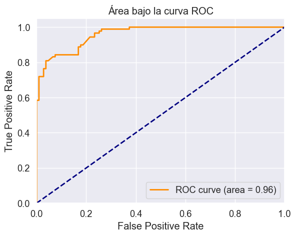

### Conclusión

La combinación de una cuidadosa selección de variables y una búsqueda exhaustiva de los mejores parámetros para la red neuronal nos permitió desarrollar un modelo altamente eficaz para nuestro problema de clasificación. La metodología adoptada asegura que nuestro modelo no solo es potente en términos de precisión predictiva, sino también robusto y generalizable a nuevos datos.

## Comparación de Modelos
A continuación omparamos los dos mejores modelos de los apartados anteriores. Estos modelos se han evaluado en base a su precisión y la métrica AUC, ambas fundamentales para la evaluación del rendimiento en la tarea de clasificación binaria "presenta obsesidad", "No presenta obsesidad".

### Resultados de la Evaluación

* **Modelo del Apartado 1:** Este modelo, desarrollado tras un proceso detallado de regresión logística, alcanzó una precisión de 0.97 y un AUC de 0.99. Estas cifras destacan el modelo como altamente efectivo, no solo en la correcta clasificación de los casos sino también en su excepcional capacidad para discriminar entre clases positivas y negativas con una gran precisión.

* **Modelo del Apartado 2:** Construido tras la selección de variables con SelectKBest (tomando únicamente 4 variables), este modelo logró una precisión de 0.88 y un AUC de 0.96. A pesar de que presenta buenos resultados, se observa que su rendimiento es algo inferior al modelo del Apartado 1, tanto en precisión como en AUC.

Comparamos ahora las matrices de confusión de ambos modelos:

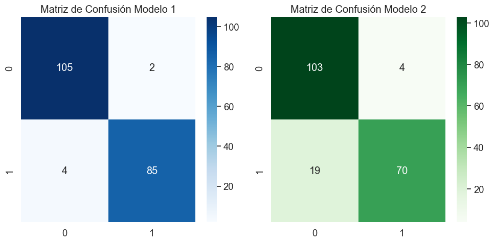

Vemos como la tasa de Verdaderos negativos es elevada en ambos casos y muy similar, por otro lado los falsos negativos son muy reducidos. No obstante, la tasa de verdaderos positivos es mayor en el primer modelo y los falsos positivos son mayores en el segundo modelo. Esto confirma el análisis anterior. 

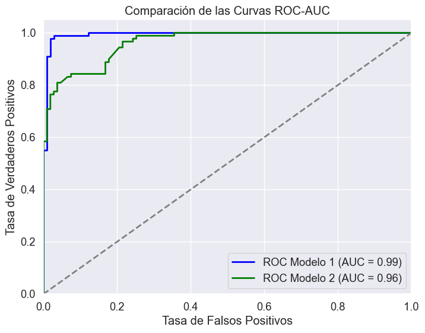

Del mismo modo, se aprecia mejor curva para el modelo del apartado 1, pues el área bajo la curva es prácticamente 1.

### Reflexión sobre las Características y Rendimientos

* **Eficiencia y Complejidad:** El modelo del Apartado 1 ilustra cómo una estrategia meticulosa en la selección de variables (con el algoritmo *stepwise* en nuestro caso) y la optimización de parámetros puede resultar en un modelo altamente eficaz sin recurrir a estructuras excesivamente complejas, de hecho es un modelo muy simple para la dimensionalidad del problema. Esto resalta la importancia de entender profundamente los datos y aplicar técnicas de modelado adecuadas.

* **Importancia de la Selección de Variables:** La selección de variables en el modelo del Apartado 2, aunque no logró superar al modelo del Apartado 1, sigue siendo una táctica valiosa que contribuye significativamente a la construcción de modelos predictivos robustos. Este enfoque puede ser especialmente útil en escenarios donde la interpretabilidad del modelo es una prioridad. Además, vemos como la penalización con respecto al accuracy del primer modelo es de solo un 10%, pese a usar únicamente 4 variables.

### Conclusión

Teniendo en cuenta los resultados revisados, reafirmamos que el modelo del Apartado 1 supera al modelo del Apartado 2 en términos de precisión y AUC. Este modelo no solamente proporciona una clasificación más precisa sino que también demuestra una habilidad sobresaliente para diferenciar efectivamente entre las clases de obesidad y no obesidad. Aunque el modelo del Apartado 1 se presenta como la opción preferida basada en los resultados cuantitativos, es crucial considerar aspectos adicionales como la interpretabilidad y la complejidad del modelo al tomar decisiones de implementación práctica.


## Mejor Búsqueda Paramétrica para Árboles de Decisión

Para lograr la mejor búsqueda paramétrica y encontrar el árbol de decisión óptimo, se implementaron cuatro métodos de validación de la bondad de la clasificación: precisión (accuracy), sensibilidad (recall), puntaje F1 (f1_score) y el área bajo la curva ROC (AUC). Utilizamos GridSearchCV para explorar exhaustivamente un conjunto predefinido de parámetros del DecisionTreeClassifier, evaluando cada combinación de parámetros con respecto a las cuatro métricas mencionadas.

### Proceso de Búsqueda Paramétrica

Se definió un espacio de búsqueda de parámetros para el DecisionTreeClassifier, considerando el criterio de división (gini o entropy), la profundidad máxima del árbol (max_depth), el mínimo número de muestras requerido para dividir un nodo interno (min_samples_split) y el mínimo número de muestras requeridas para estar en un nodo hoja (min_samples_leaf). La configuración de GridSearchCV incluyó estos parámetros y utilizó la validación cruzada de 5-folds para asegurar una evaluación robusta de cada modelo. Usamos el siguiente código para ello:

```py
# Definimos el modelo base
tree = DecisionTreeClassifier()

# Definimos el espacio de búsqueda de los parámetros
param_grid = {
    'criterion': ['gini', 'entropy'],
    'max_depth': [None, 10, 20, 30],
    'min_samples_split': [2, 5, 10],
    'min_samples_leaf': [1, 2, 4],
}

# Definimos las métricas de evaluación personalizadas
scoring = {
    'accuracy': make_scorer(accuracy_score),
    'recall': make_scorer(recall_score, average='macro'),
    'f1_score': make_scorer(f1_score, average='macro'),
    # Asegúrate de que tu problema sea de clasificación binaria para usar roc_auc
    'auc': 'roc_auc_ovr',
}

# Configuramos GridSearchCV
grid_search = GridSearchCV(estimator=tree, param_grid=param_grid, scoring=scoring, refit='accuracy', cv=5, verbose=1)

# Ejecutamos la búsqueda
grid_search.fit(X_train_preprocessed, y_train)

# Mostramos los mejores parámetros y la mejor puntuación
print("Mejores parámetros:", grid_search.best_params_)
print("Mejor puntuación según accuracy:", grid_search.best_score_)

# Para ver los resultados para las demás métricas, necesitas acceder a cv_results_
print("Puntuaciones para todas las métricas:", grid_search.cv_results_)
```


### Métricas de Evaluación

Se emplearon cuatro métricas de evaluación personalizadas: precisión, sensibilidad, puntaje F1 y AUC. Estas métricas proporcionan una visión comprensiva del rendimiento del modelo, evaluando no solo la exactitud de las clasificaciones (precisión), sino también cómo el modelo identifica correctamente las clases positivas (sensibilidad), la balanza entre precisión y sensibilidad (puntaje F1) y su capacidad para distinguir entre clases (AUC). Usamoes el siguiente código:

```py
# Reentrenamos el mejor modelo sobre todo el conjunto de datos
best_tree = DecisionTreeClassifier(**grid_search.best_params_)
best_tree.fit(X_train_preprocessed, y_train)

# Predicciones con el mejor modelo
y_pred = best_tree.predict(X_test_preprocessed)

# Cálculo manual de cada métrica
accuracy = accuracy_score(y_test, y_pred)
recall = recall_score(y_test, y_pred, average='macro')
f1 = f1_score(y_test, y_pred, average='macro')
# Para AUC, necesitamos predicciones de probabilidad y considerar cada clase binariamente
y_prob = best_tree.predict_proba(X_test_preprocessed)
if y_prob.shape[1] == 2:  # Problema binario
    auc = roc_auc_score(y_test, y_prob[:, 1])
else:  # Problema multiclase
    auc = roc_auc_score(y_test, y_prob, multi_class='ovr')

print("Resultados del mejor modelo:")
print(f"Accuracy: {accuracy}")
print(f"Recall: {recall}")
print(f"F1 Score: {f1}")
print(f"AUC: {auc}")

# Para obtener un informe más detallado que incluya precision además de recall y F1-score
print("\nInforme de clasificación:")
print(classification_report(y_test, y_pred))
```

### Resultados

El proceso de búsqueda identificó que el mejor modelo se logra utilizando el criterio entropy, sin limitar la profundidad máxima (max_depth=None), con un mínimo de 4 muestras por hoja (min_samples_leaf=4) y requiriendo al menos 2 muestras para dividir un nodo (min_samples_split=2). Este modelo alcanzó la mejor puntuación según la precisión con un valor de 0.9757880124122164.
Evaluación del Mejor Modelo

El modelo óptimo fue evaluado en un conjunto de prueba independiente, revelando una precisión de 0.9744897959183674, un recall macro de 0.9738002730232069, un puntaje F1 macro de 0.974247799237945, y un AUC de 0.9776330988133992. Estos resultados demuestran que el modelo no solo es preciso en general, sino que también mantiene un equilibrio adecuado entre la sensibilidad y la especificidad para las clases involucradas, además de poseer una excelente capacidad de discriminación entre clases.
Conclusión

La búsqueda paramétrica detallada utilizando GridSearchCV y la evaluación basada en múltiples métricas permitieron identificar un árbol de decisión altamente efectivo. Este modelo equilibra bien entre evitar el sobreajuste y mantener una alta capacidad de generalización, destacándose por su precisión, sensibilidad, puntaje F1 y AUC en la clasificación. La implementación meticulosa y la evaluación rigurosa aseguran que el modelo seleccionado es adecuado para aplicaciones prácticas, proporcionando decisiones de clasificación confiables y valiosas para la toma de decisiones basada en datos.

### Importancia de las variables

Representamos la importancia de cada variable con el siguiente código:

```py
# Asumiendo que best_tree es tu modelo entrenado
df_importancia_c = pd.DataFrame({
    'Variable': transformed_feature_names,  # Usa tu lista de nombres de características aquí
    'Importancia': best_tree.feature_importances_
}).sort_values(by='Importancia', ascending=False)

# Crear un gráfico de barras
plt.figure(figsize=(10, 6))  # Ajustar el tamaño de la figura
plt.bar(df_importancia_c['Variable'], df_importancia_c['Importancia'], color='skyblue')
plt.xlabel('Variable')
plt.ylabel('Importancia')
plt.title('Importancia de las características')
plt.xticks(rotation=45, ha='right')
plt.tight_layout()

# Mostrar el gráfico
plt.show()
```

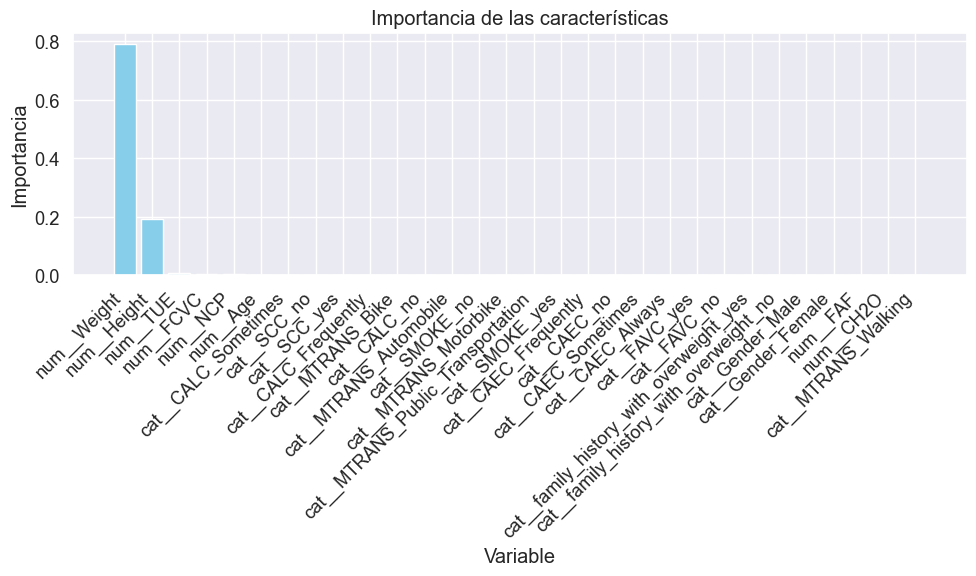

Podemos ver cómo las dos más importantes son la **altura** y **peso**, como es de esperar, pues son las que determinan principalmente si alguien es obeso o no.


### Representación Gráfica del Árbol Ganador

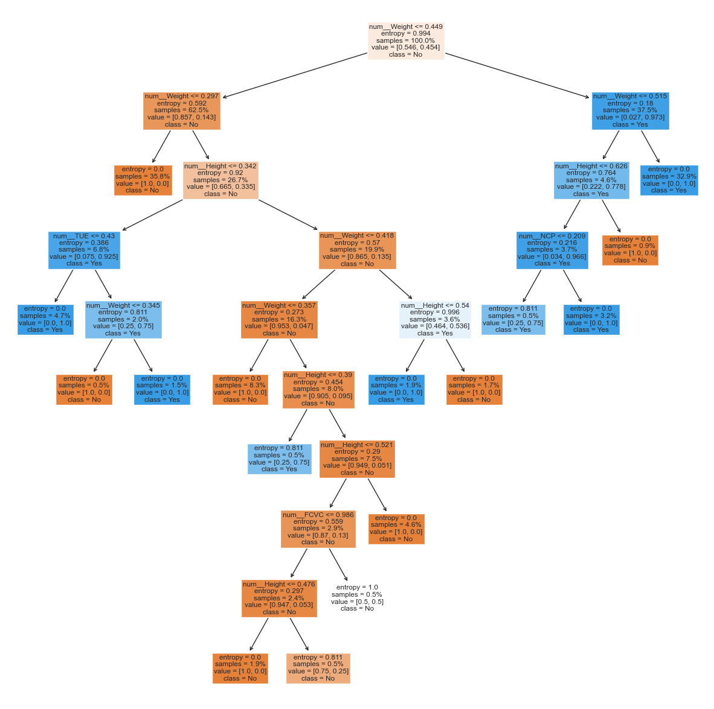

Una ventaja de los árboles de decisión son su gran capacidad explicativa a la hora de determinar la etiqueta para cada elemento que procesan. Se detalla a continuación la explicación para comprender el gráfico:

* **Nodos Raíz y Nodos Internos**: El nodo superior (nodo raíz) y los nodos intermedios representan las preguntas o "decisiones" basadas en los atributos de los datos. Por ejemplo, el nodo raíz divide los datos en dos ramas basadas en si num_Weight <= 0.449. Esto significa que el primer criterio que el árbol utiliza para dividir el conjunto de datos es el peso (normalizado o estandarizado), y 0.449 es el valor de umbral.

* **Ramas**: Cada división o "pregunta" da lugar a dos ramas, llevando a otro nodo (que puede ser un nodo interno o una hoja). La rama izquierda siempre representa una respuesta "Sí" a la pregunta (en este caso, los pesos menores o iguales a 0.449), y la rama derecha representa una respuesta "No".

* **Nodos Hoja**: Las hojas finales del árbol, donde no hay más divisiones, representan las predicciones finales del árbol. Cada nodo hoja muestra la clase que se predice para las observaciones que llegan a ese punto. Además, muestra la entropía de ese nodo, la cantidad de muestras que caen en ese nodo, y la distribución de las clases de esas muestras. Por ejemplo, en uno de los nodos hoja del lado izquierdo, la clase es 'No', lo que indica que las muestras que llegan a este punto son clasificadas como 'No' por el modelo. La entropía de 0 implica que todas las muestras en ese nodo son de una sola clase, haciendo que este nodo sea perfectamente puro.

* **Información en los Nodos**: Dentro de cada nodo se incluye la siguiente información:
    * *Condición de división:* como num_Weight <= 0.357.
    * *Entropía:* una medida de la impureza del nodo. Una entropía de 0 significa que todas las muestras en ese nodo pertenecen a una sola clase.
    * *Número de muestras:* cuántas muestras del conjunto de entrenamiento caen en ese nodo.
    * *Distribución de la clase:* muestra en formato [cantidad de clase 'No', cantidad de clase 'Yes'] cuántas muestras pertenecen a cada clase.
    * *Clase dominante:* la etiqueta de clase que se asigna a las muestras en ese nodo.

* **División del Árbol**: El árbol se divide para aumentar la pureza de los nodos resultantes (es decir, tratar de obtener nodos donde las muestras pertenezcan a una sola clase), lo que generalmente mejora la capacidad del modelo para hacer predicciones precisas.

### Representación de las reglas en modo texto
Podemos visualizar las reglas del árbol en modo texto con el siguiente código:

```py
tree_rules = export_text(best_tree, feature_names=transformed_feature_names)
print(tree_rules)
```

```bash
|--- num__Weight <= 0.45
|   |--- num__Weight <= 0.30
|   |   |--- class: 0
|   |--- num__Weight >  0.30
|   |   |--- num__Height <= 0.34
|   |   |   |--- num__TUE <= 0.43
|   |   |   |   |--- class: 1
|   |   |   |--- num__TUE >  0.43
|   |   |   |   |--- num__Weight <= 0.35
|   |   |   |   |   |--- class: 0
|   |   |   |   |--- num__Weight >  0.35
|   |   |   |   |   |--- class: 1
|   |   |--- num__Height >  0.34
|   |   |   |--- num__Weight <= 0.42
|   |   |   |   |--- num__Weight <= 0.36
|   |   |   |   |   |--- class: 0
|   |   |   |   |--- num__Weight >  0.36
|   |   |   |   |   |--- num__Height <= 0.39
|   |   |   |   |   |   |--- class: 1
|   |   |   |   |   |--- num__Height >  0.39
|   |   |   |   |   |   |--- num__Height <= 0.52
|   |   |   |   |   |   |   |--- num__FCVC <= 0.99
|   |   |   |   |   |   |   |   |--- num__Height <= 0.48
|   |   |   |   |   |   |   |   |   |--- class: 0
|   |   |   |   |   |   |   |   |--- num__Height >  0.48
...
|   |   |   |--- class: 0
|   |--- num__Weight >  0.51
|   |   |--- class: 1
```

## Mejor Modelo de Bagging y Random Forest

### Preprocesamiento
Para ambos modelos, el preprocesamiento explicado en el primer apartado es válido y nos hemos asegurado de qu la distribución de elementos positivos y negativos mantienen la misma relación en ambos conjuntos de entrenamiento y test.


### Mejor Modelo de Bagging

Para el modelo de Bagging, se eligió un clasificador de ensamble basado en árboles de decisión como estimador base. Se realizó una búsqueda de parámetros utilizando GridSearchCV, con un enfoque en tres parámetros clave:

    n_estimators: Número de árboles en el ensamble.
    max_samples: Fracción del número total de muestras utilizadas para ajustar cada árbol base.
    max_features: Fracción del número total de características consideradas para dividir cada nodo.

El siguiente fragmento de código muestra la implementación de la búsqueda de parámetros:


```py
param_grid = {
    'n_estimators': [10, 50, 100],
    'max_samples': [0.5, 0.75, 1.0],
    'max_features': [0.5, 0.75, 1.0]
}

# Configuración y ejecución de GridSearchCV
grid_search = GridSearchCV(estimator=bagging_cls, param_grid=param_grid, cv=5, scoring='accuracy')
grid_search.fit(X_train_preprocessed, y_train)

# Resultados
print(f"Best parameters: {grid_search.best_params_}")
print(f"Best cross-validation score: {grid_search.best_score_}")
```

Los resultados del GridSearchCV revelaron que la mejor configuración para el modelo de Bagging incluye 50 estimadores, y un max_samples y max_features del 75%. Esto significa que cada árbol en el ensamble se construye con el 75% de las muestras y características disponibles, ofreciendo así diversidad en el modelo y evitando sobreajuste y obteniendo un 0.98 de Accuracy en la mejor partición de *cross-validation*.

Podemos ver en detalle la distribución de la precisión por las distintas particiones de cross-validation:

.[](./img/bagging_cross_val.png)

Vemos como las cajas son muy estrechas oscilando entre un 0.96-1. Lo que indica una gran fiabilidad y consistencia del modelo.

#### Rendimiento del Modelo

El modelo final de Bagging fue evaluado en conjuntos de datos de entrenamiento y prueba:

```py
train_accuracy = accuracy_score(y_train, y_train_pred)
test_accuracy = accuracy_score(y_test, y_test_pred)

print(f"Training accuracy: {train_accuracy}")
print(f"Test accuracy: {test_accuracy}")
```

El modelo alcanzó una precisión perfecta en el entrenamiento (100%) y una precisión de 97.45% en el conjunto de prueba. Un informe de clasificación proporcionó detalles adicionales de la precisión, recall y F1-score para cada clase, reflejando un excelente equilibrio entre la detección de clases.

Podemos ver el rendimiento gráficamente en la matriz de confusión (apenas cuenta con falsos positivos y negativos):


### Mejor Modelo de Random Forest

Para el modelo de Random Forest, se utilizó un enfoque similar con GridSearchCV, centrándose en n_estimators, max_features, y max_depth como los parámetros críticos. Aquí está el código relevante para la configuración del RandomForestClassifier:

```python
# Definición del espacio de parámetros
param_grid = {
    'n_estimators': [50, 100, 150],
    'max_features': ['sqrt', 0.25, 0.5],
    'max_depth': [10, 20, None]
}

# Búsqueda de parámetros con GridSearchCV
grid_search_rf = GridSearchCV(estimator=rf, param_grid=param_grid, cv=5, scoring='accuracy')
grid_search_rf.fit(X_train_preprocessed, y_train)

# Resultados
print("Mejores parámetros:", grid_search_rf.best_params_)
```

El modelo óptimo de Random Forest se encontró con una profundidad máxima de 10, utilizando el 50% de las características y 50 estimadores. Esto sugiere que un enfoque más restrictivo en la profundidad del árbol ayuda a mejorar la generalización del modelo sin sacrificar precisión.


Vemos como las cajas son muy estrechas oscilando entre un 0.96-1. Lo que indica una gran fiabilidad y consistencia del modelo.

#### Rendimiento del Modelo

El Random Forest se evaluó en los conjuntos de entrenamiento y prueba para verificar la precisión y evitar sobreajuste:

```python
# Evaluación en entrenamiento y prueba
accuracy_train_rf = accuracy_score(y_train, y_train_pred_rf)
accuracy_test_rf = accuracy_score(y_test, y_test_pred_rf)

print(f"Accuracy en entrenamiento: {accuracy_train_rf}")
print(f"Accuracy en prueba: {accuracy_test_rf}")
```


El modelo de Random Forest aquí desarrollado demuestra ser extremadamente robusto y eficaz, con un rendimiento sobresaliente tanto en los conjuntos de entrenamiento como de prueba. La selección cuidadosa de los parámetros ha permitido optimizar el modelo para lograr una alta precisión y un excelente balance entre la detección de las distintas clases. Con una precisión cercana al 97.45% en el conjunto de prueba, este modelo se posiciona como una herramienta confiable y potente para la tarea de clasificación en cuestión.

Podemos ver el rendimiento gráficamente en la matriz de confusión (apenas cuenta con falsos positivos y negativos):


## Mejor Modelo de Gradiente Boosting y XGBoost

El preprocesamiento de los datos de nuevo es el realizado en el primer apartado de este trabajo.

### Mejor Búsqueda Paramétrica para Gradiente Boosting según Accuracy

Gradiente Boosting es una técnica de ensamble que construye modelos predictivos de manera secuencial. Cada nuevo modelo se enfoca en corregir los errores del modelo anterior, mejorando gradualmente la precisión del ensamble completo. La búsqueda paramétrica se realizó utilizando GridSearchCV, ajustando los siguientes parámetros clave:

```python
from sklearn.ensemble import GradientBoostingClassifier
from sklearn.model_selection import GridSearchCV
from sklearn.metrics import accuracy_score

# Definir el espacio de búsqueda de parámetros
param_grid = {
    'n_estimators': [100, 200],
    'learning_rate': [0.05, 0.1],
    'max_depth': [3, 5],
    'min_samples_split': [2, 5],
    'min_samples_leaf': [1, 2],
    'max_features': ['sqrt', 'log2'],
    'subsample': [0.8, 1.0]
}

# Inicializar el clasificador de Gradient Boosting
gb = GradientBoostingClassifier(random_state=0)

# Configurar GridSearchCV
grid_search = GridSearchCV(estimator=gb, param_grid=param_grid, cv=5, scoring='accuracy', verbose=1)

# Ajustar GridSearchCV
grid_search.fit(X_train_preprocessed, y_train)

# Mejores parámetros encontrados
print(f'Mejores parámetros: {grid_search.best_params_}')
```

Los parámetros considerados en la búsqueda fueron:

    n_estimators: Número de árboles secuenciales a construir. Más árboles pueden mejorar la precisión pero también incrementar el riesgo de sobreajuste.
    learning_rate: Tasa de aprendizaje que controla el grado en que cada árbol influye en el modelo final. Una tasa más baja requiere más árboles, pero puede mejorar la generalización.
    max_depth: Profundidad máxima de cada árbol. Limitar la profundidad ayuda a prevenir el sobreajuste.
    min_samples_split: Número mínimo de observaciones necesarias para dividir un nodo interno.
    min_samples_leaf: Número mínimo de observaciones requeridas para ser un nodo hoja.
    max_features: Número máximo de características a considerar para la mejor división.
    subsample: Fracción de muestras a utilizar para ajustar cada árbol, lo que permite un aprendizaje estocástico.

La configuración de GridSearchCV permitió evaluar combinaciones de estos parámetros para identificar la configuración óptima según la precisión.

Los mejores parámetros encontrados para el modelo de Gradient Boosting y la evaluación de rendimiento son los siguientes:

```python
# Mejor modelo
best_gb = grid_search.best_estimator_

# Predicciones y evaluación
y_pred_train = best_gb.predict(X_train_preprocessed)
y_pred_test = best_gb.predict(X_test_preprocessed)
accuracy_train = accuracy_score(y_train, y_pred_train)
accuracy_test = accuracy_score(y_test, y_pred_test)

print(f'Precisión en entrenamiento: {accuracy_train}')
print(f'Precisión en prueba: {accuracy_test}')
```

Resultados de la evaluación del mejor modelo:

```
Mejores parámetros: {'learning_rate': 0.1, 'max_depth': 5, 'max_features': 'sqrt', 'min_samples_leaf': 2, 'min_samples_split': 5, 'n_estimators': 200, 'subsample': 0.8}
Puntuación del mejor modelo en entrenamiento (cross-validation): 0.9821492732320758
Precisión en el conjunto de prueba: 0.9795918367346939

              precision    recall  f1-score   support

           0       0.97      0.99      0.98       107
           1       0.99      0.97      0.98        89

    accuracy                           0.98       196
   macro avg       0.98      0.98      0.98       196
weighted avg       0.98      0.98      0.98       196
```

Este rendimiento demuestra la efectividad del modelo de Gradient Boosting en la tarea de clasificación, resaltando la importancia de la configuración adecuada de los hiperparámetros para lograr un alto rendimiento. La capacidad del modelo para generalizar bien a nuevos datos lo convierte en una herramienta valiosa en el campo de la salud pública.

### Mejor Búsqueda Paramétrica para XGBoost según Accuracy

XGBoost (eXtreme Gradient Boosting) es una implementación optimizada de Gradient Boosting diseñada para ser altamente eficiente, flexible y portátil. Realiza el entrenamiento de manera más rápida y con mejor rendimiento que la implementación estándar de Gradient Boosting. La búsqueda de los mejores parámetros para XGBoost incluyó:

```python
from sklearn.model_selection import GridSearchCV
from xgboost import XGBClassifier

# Definir el modelo
xgb_model = XGBClassifier(use_label_encoder=False, eval_metric='logloss')

# Definir el espacio de búsqueda de parámetros
param_grid = {
    'n_estimators': [100, 200],
    'learning_rate': [0.01, 0.1],
    'max_depth': [3, 5],
    'colsample_bytree': [0.3, 0.7]
}

# Configurar GridSearchCV
grid_search = GridSearchCV(estimator=xgb_model, param_grid=param_grid, cv=5, scoring='accuracy')

# Ajustar GridSearchCV
grid_search.fit(X_train_preprocessed, y_train)

# Mejores parámetros encontrados
print(f'Mejores parámetros: {grid_search.best_params_}')
```
Los parámetros explorados incluyeron:

    n_estimators: Define el número de ciclos de boosting, esencialmente cuántos árboles secuenciales se construyen.
    learning_rate: Controla el impacto de cada árbol en el resultado final, un balance entre rendimiento y riesgo de sobreajuste.
    max_depth: La profundidad máxima de los árboles, que ayuda a controlar la complejidad y el sobreajuste.
    colsample_bytree: La fracción de columnas (características) usadas para cada árbol, una forma de realizar muestreo de características.

Los mejores parámetros encontrados para el modelo de XGBoost y la evaluación de rendimiento son los siguientes:

```python
# Mejor modelo
best_xgb = grid_search.best_estimator_

# Predicciones y evaluación
y_pred_train = best_xgb.predict(X_train_preprocessed)
y_pred_test = best_xgb.predict(X_test_preprocessed)
accuracy_train = accuracy_score(y_train, y_pred_train)
accuracy_test = accuracy_score(y_test, y_pred_test)

print(f'Precisión en entrenamiento: {accuracy_train}')
print(f'Precisión en prueba: {accuracy_test}')
```

Resultados de la evaluación del mejor modelo:

```
Mejores parámetros: {'colsample_bytree': 0.7, 'learning_rate': 0.1, 'max_depth': 3, 'n_estimators': 100}
Puntuación del mejor modelo en entrenamiento (cross-validation): 0.9821492732320758
Precisión en el conjunto de prueba: 0.9846938775510204

              precision    recall  f1-score   support

           0       0.98      0.99      0.98       107
           1       0.99      0.98      0.98        89

    accuracy                           0.98       196
   macro avg       0.98      0.98      0.98       196
weighted avg       0.98      0.98      0.98       196
```

Este rendimiento demuestra la efectividad del modelo de XGBoost en la tarea de clasificación, resaltando la importancia de la configuración adecuada de los hiperparámetros para lograr un alto rendimiento. La capacidad del modelo para generalizar bien a nuevos datos lo convierte en una herramienta valiosa en el campo de la salud pública.

## Mejor Modelo de SVM con Diferentes Kernels

### Preprocesamiento

Dado que las SVM son sensibles a la escala de los datos y no manejan directamente variables categóricas, se implementó en el primer apartado de este trabajo un preprocesamiento compuesto por un escalado MinMax para variables numéricas y codificación OneHot para variables categóricas. Esta estrategia asegura que todas las características tengan el mismo peso en la formulación del modelo, y transforma las variables categóricas en un formato adecuado para el modelo SVM.

### Búsqueda Paramétrica

Para la selección del mejor modelo, utilizamos `GridSearchCV` con validación cruzada, probando combinaciones de los siguientes parámetros en el espacio de búsqueda:

- **C (Parámetro de regularización):** Se exploraron los valores [0.1, 1, 10, 100], donde un C menor conduce a un margen de decisión más suave (mayor regularización), y un C mayor busca clasificar correctamente todas las muestras de entrenamiento, lo que puede llevar a un modelo más complejo y posiblemente a sobreajuste.
- **Kernel:** Se evaluaron dos tipos de kernels, `linear` y `rbf`. El kernel lineal es útil para datos linealmente separables, mientras que el kernel radial basis function (RBF) puede modelar fronteras de decisión no lineales, ofreciendo mayor flexibilidad.
- **Gamma (Para kernel RBF):** Los valores [0.001, 0.0001, 'scale', 'auto'] regulan la influencia de cada muestra individual; valores más bajos indican una influencia más amplia, posiblemente llevando a fronteras de decisión más suaves.

El código empleado es el siguiente:

```py
# Preprocesador
preprocessor = ColumnTransformer(
    transformers=[
        ('num', StandardScaler(), numerical_columns),
        ('cat', OneHotEncoder(), categorical_columns)
    ]
)

# Pipeline con preprocesador y SVC
pipeline = Pipeline([
    ('preprocessor', preprocessor),
    ('svc', SVC(random_state=42))
])

# Espacio de parámetros para GridSearchCV
param_grid = {
    'svc__C': [0.1, 1, 10, 100],  # Valores comunes para C
    'svc__kernel': ['linear', 'rbf'],  # Kernels a probar
    'svc__gamma': [0.001, 0.0001, 'scale', 'auto']  # parámetros para el kernel 'rbf'
}

# Aplicar GridSearchCV con validación cruzada
grid_search = GridSearchCV(pipeline, param_grid, cv=5, scoring='accuracy', verbose=10)
grid_search.fit(X_train, y_train)

# Mejores parámetros y mejor puntuación
print("Mejores parámetros:", grid_search.best_params_)
print("Mejor puntuación de validación cruzada:", grid_search.best_score_)
```


### Resultados y Evaluación

El mejor modelo obtenido presentó los siguientes parámetros: `{'svc__C': 100, 'svc__gamma': 0.001, 'svc__kernel': 'linear'}`, lo que indica una preferencia por un alto grado de regularización con un kernel lineal. Esto sugiere que, para nuestro conjunto de datos, la relación entre las clases puede ser aproximadamente lineal en el espacio transformado por el preprocesador.

La precisión en el conjunto de entrenamiento fue del 99.36%, y en el conjunto de prueba del 97.96%, demostrando una excelente generalización del modelo seleccionado. La casi igual precisión entre los conjuntos de entrenamiento y prueba sugiere que el modelo es robusto y no sufre de sobreajuste significativo.

La distribución del error en las distintas particiones de validación cruzada es la siguiente:
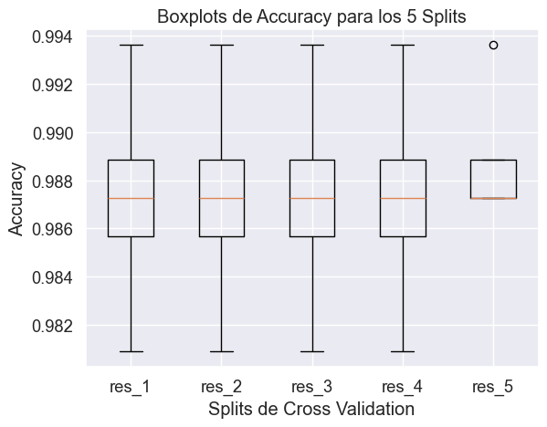

Vemos como la amplitud de las cajas es muy pequeña, signo de robustez del modelo.

### Interpretación de las Métricas

El análisis de la evaluación del modelo SVM en el conjunto de prueba revela una precisión general sobresaliente del 97.96%. Este alto nivel de precisión indica que el modelo es capaz de clasificar correctamente a casi todos los individuos en las categorías de obeso y no obeso. Examinando más de cerca las métricas de precisión, recall y f1-score para cada clase, obtenemos una visión más detallada de cómo el modelo se desempeña en tareas específicas de clasificación.

```bash
              precision    recall  f1-score   support

           0       0.98      0.98      0.98       107
           1       0.98      0.98      0.98        89

    accuracy                           0.98       196
   macro avg       0.98      0.98      0.98       196
weighted avg       0.98      0.98      0.98       196
```

- **Precisión (Precision):** Tanto para la clase 0 (no obeso) como para la clase 1 (obeso), la precisión es del 98%. Esto significa que, del total de predicciones que el modelo hizo para cada clase, el 98% fue correcto. En otras palabras, cuando el modelo predice que un individuo pertenece a una de estas categorías, es muy probable que esta predicción sea correcta.

- **Recall (Sensibilidad):** El recall también es del 98% para ambas clases. Esto indica que el modelo es capaz de identificar correctamente el 98% de los casos reales de cada clase. Por ejemplo, de todos los individuos que son verdaderamente obesos, el modelo pudo reconocer correctamente el 98% de ellos.

- **F1-Score:** El f1-score, que es una media armónica entre la precisión y el recall, se mantiene en el 98% para ambas clases. Este alto f1-score sugiere un equilibrio excelente entre la precisión y el recall, lo cual es especialmente importante en aplicaciones médicas o de salud donde tanto los falsos positivos como los falsos negativos pueden tener consecuencias significativas.

- **Soporte (Support):** El soporte indica el número de ocurrencias reales de cada clase en el conjunto de prueba, con 107 no obesos y 89 obesos. La distribución relativamente equilibrada de las clases ayuda a garantizar que el modelo esté bien equilibrado y no sesgado hacia una clase específica.

La precisión global y las métricas detalladas para cada clase muestran que el modelo SVM, con su configuración optimizada de parámetros, es extremadamente efectivo para clasificar individuos en las categorías de obeso y no obeso. La alta precisión, recall y f1-score para ambas clases indican que el modelo tiene una gran capacidad tanto para identificar correctamente a los individuos obesos como para minimizar los errores de clasificación, como los falsos positivos y los falsos negativos.

## Método de Ensamblado de Bagging

## Método de Ensamblado de Bagging con SVC como Clasificador Base

El método de ensamblado de Bagging (Bootstrap Aggregating) se utilizó para mejorar la precisión y estabilidad de un clasificador base mediante la combinación de múltiples modelos que se entrenan con diferentes subconjuntos del conjunto de datos original. Este subconjunto se genera mediante muestreo con reemplazo, lo que significa que el mismo dato puede aparecer varias veces en un subconjunto, y algunos datos pueden no aparecer en absoluto. Luego, las predicciones de todos los modelos se agregan para formar la predicción final, típicamente por votación mayoritaria para clasificación o promedio para regresión.

### Clasificador Base: SVC

En este caso, se eligió el `SVC` (Support Vector Classifier) como clasificador base. SVC es conocido por su eficacia en espacios de alta dimensión y su capacidad para manejar fronteras de decisión no lineales a través de la elección del kernel. Aunque el uso de árboles de decisión es más común en los métodos de bagging, la selección de SVC ofrece una perspectiva interesante, especialmente en conjuntos de datos donde las relaciones lineales o no lineales entre las características y las etiquetas pueden ser capturadas más eficazmente por máquinas de vectores de soporte.

### Parametrizaciones y Parámetros Escogidos

#### Preprocesamiento

El preprocesamiento se ha cambiado ligeramente, sustituyendo el `MinMaxScaler` por el `StandardScaler` para las variables numéricas y manteniendo `OneHotEncoder` para las categóricas, garantizando que todas las características se traten en una escala comparable y se conviertan adecuadamente para el SVC, que no maneja directamente variables categóricas.

#### BaggingClassifier

Se inicializa `BaggingClassifier` con SVM como el estimador base (debido al buen rendimiento en apartados anteriores) y se configura con 100 estimadores inicialmente. La configuración de múltiples estimadores permite al método de bagging aprovechar al máximo el muestreo con reemplazo, creando modelos diversificados que pueden capturar diferentes aspectos de los datos cuando se combinan.

#### GridSearchCV

Se define una cuadrícula de parámetros para explorar diferentes configuraciones del BaggingClassifier y del SVC. Los parámetros incluyen:
- `bagging__n_estimators`: [10, 20, 50], ajusta el número de modelos en el ensamble. Un número mayor de estimadores puede aumentar la precisión pero también el tiempo de cómputo.
- `bagging__estimator__C`: [0.1, 1, 10], el parámetro de regularización para SVC que controla el compromiso entre lograr un margen alto y clasificar todos los puntos de entrenamiento correctamente.
- `bagging__estimator__kernel`: ['linear', 'rbf'], determina el tipo de hiperplano utilizado para separar los datos. `linear` es útil para datos linealmente separables, mientras que `rbf` permite fronteras de decisión más flexibles.

El código empleado es el siguiente:

```py
# Preprocesador para variables numéricas y categóricas (ajustar según tus datos)
preprocessor = ColumnTransformer(
    transformers=[
        ('num', StandardScaler(), numerical_columns),  # Ajustar nombres de columnas numéricas
        ('cat', OneHotEncoder(), categorical_columns)   # Ajustar nombres de columnas categóricas
    ]
)

# Initialize the BaggingClassifier with the base estimator
bgclassifier = BaggingClassifier(estimator=SVC(), n_estimators=100, random_state=4975)

# Pipeline con preprocesador y BaggingClassifier utilizando SVC como clasificador base
pipeline = Pipeline([
    ('preprocessor', preprocessor),
    ('bagging', bgclassifier)
])

# Definir la cuadrícula de parámetros para GridSearchCV
param_grid = {
    'bagging__n_estimators': [10, 20, 50],  # Número de estimadores en el ensamblado
    'bagging__estimator__C': [0.1, 1, 10],  # Parámetro de regularización para SVC
    'bagging__estimator__kernel': ['linear', 'rbf'],  # Kernel para SVC
}

# Aplicar GridSearchCV
grid_search = GridSearchCV(pipeline, param_grid, cv=5, scoring='accuracy', verbose=10)
grid_search.fit(X_train, y_train)

# Mejores parámetros y puntuación
print("Mejores parámetros:", grid_search.best_params_)
print("Mejor puntuación de validación cruzada:", grid_search.best_score_)

# Evaluar el modelo en el conjunto de prueba
y_pred = grid_search.predict(X_test)
print("Precisión en el conjunto de prueba:", accuracy_score(y_test, y_pred))
```

Vemos la distribución de errores de cada partición a continuación:
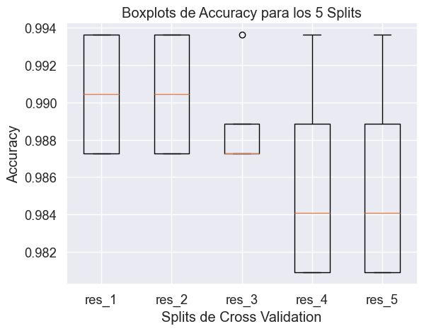

Como vemos, de nuevo son muy compactas las cajas, lo que demuestra la consistencia de los modelos.

### Resultados

Los mejores parámetros encontrados fueron: `{'bagging__estimator__C': 10, 'bagging__estimator__kernel': 'linear', 'bagging__n_estimators': 20}`. Esto indica que un modelo SVC con un margen de decisión más estricto (`C` de 10) y un kernel lineal, complementado con 20 modelos en el ensamble, proporciona el mejor equilibrio entre sesgo y varianza, logrando una alta precisión.

La puntuación de validación cruzada de 0.987 y la precisión en el conjunto de prueba de 0.985 demuestran la efectividad de esta configuración, superando a menudo lo que se podría lograr con un único clasificador SVC. El enfoque de bagging, especialmente con un clasificador no convencional como base, muestra su versatilidad y potencial para mejorar significativamente la precisión y robustez de modelos predictivos complejos.

## Método de Stacking

En el apartado anterior, hemos implementado un método de ensamble avanzado conocido como Stacking (Apilamiento), el cual consiste en combinar múltiples modelos de clasificación o regresión (modelos base) para luego utilizar un modelo de nivel superior para integrar sus predicciones. Este enfoque permite aprovechar las fortalezas de cada uno de los modelos base y mejorar la precisión de las predicciones finales. Veamos cómo se llevó a cabo este proceso paso a paso, incluyendo la selección de modelos base, la generación de características de stacking, y la utilización de un modelo de nivel superior para el ensamble final.

### Modelos Base para el Stacking

Se escogieron tres algoritmos ampliamente reconocidos por su desempeño en tareas de clasificación:
- `LogisticRegression`: Por su eficacia en la clasificación binaria y su capacidad para proporcionar probabilidades de clasificación.
- `SVC` (Support Vector Classifier): Elegido por su flexibilidad en manejar fronteras de decisión no lineales, habilitando `probability=True` para obtener estimaciones de probabilidad.
- `RandomForestClassifier`: Por su robustez y habilidad para manejar características de alta dimensionalidad sin necesidad de preprocesamiento extensivo.

### Entrenamiento de los Modelos Base

Cada modelo base fue entrenado utilizando el conjunto de entrenamiento preprocesado (`X_train_preprocessed`), permitiéndoles aprender de los datos y prepararse para generar las características de stacking.

### Generación de Características de Stacking

Utilizando la función `stacking` de la biblioteca `vecstack`, generamos un nuevo conjunto de características (`S_train` para entrenamiento y `S_test` para pruebas) basado en las predicciones de los modelos base. Este proceso se realizó mediante validación cruzada, con 4 particiones (`n_folds=4`), de manera estratificada y con un `shuffle` aleatorio, utilizando un `random_state=4975` para garantizar la reproducibilidad.

Los modelos base mostraron diferentes niveles de error medio absoluto en las particiones de validación cruzada, con la `RandomForestClassifier` presentando el menor error, lo que sugiere una fuerte capacidad predictiva por parte de este modelo en comparación con los demás.

### Modelo de Nivel Superior

Como modelo de ensamble de nivel superior, se escogió una `LogisticRegression`, debido a su simplicidad y efectividad en tareas de clasificación. Este modelo fue entrenado con las características de stacking (`S_train`), aprendiendo cómo integrar de manera óptima las predicciones de los modelos base.

### Evaluación del Modelo de Ensamble

Las predicciones finales sobre el conjunto de prueba (`S_test`) se realizaron utilizando el modelo de nivel superior, alcanzando una precisión de **0.9694**. Este resultado demuestra la eficacia del método de stacking en la mejora de la precisión predictiva, superando probablemente a los modelos individuales gracias a la sinergia creada al combinar sus diferentes aproximaciones al problema de clasificación.

### Conclusión

El método de Stacking implementado muestra cómo la combinación estratégica de modelos con distintas fortalezas y la aplicación de un modelo de nivel superior para integrar sus predicciones pueden resultar en una mejora significativa de la precisión en tareas de clasificación. Este enfoque ofrece un ejemplo claro de cómo las técnicas de ensamble avanzadas pueden ser utilizadas para lograr un rendimiento superior en la predicción, aprovechando la diversidad de los modelos base para capturar diferentes aspectos de los datos y mejorar la generalización del modelo final.

## Conclusiones

A lo largo de este análisis exhaustivo, hemos aplicado y evaluado una amplia gama de modelos predictivos, diseñados meticulosamente con estrategias particulares para la selección de características y la optimización de hiperparámetros. Centrando nuestros esfuerzos en la clasificación precisa de la obesidad a través de variables biométricas y de estilo de vida, hemos explorado desde modelos fundamentales como la regresión logística hasta complejas redes neuronales. Cada uno ha aportado valiosas perspectivas, demostrando la riqueza de enfoques disponibles en el modelado predictivo. Entre estos, los modelos de ensamble como el Bagging y Random Forest han resaltado por su capacidad para mejorar tanto la precisión como la generalización de las predicciones.

El innovador método de ensamble avanzado utilizando Bagging con SVC como clasificador base ha demostrado la efectividad de combinar múltiples modelos entrenados con subconjuntos distintos de datos, no solo mejorando la precisión y la estabilidad sino también explorando el potencial del SVC dentro de un contexto de ensamble, alcanzando una impresionante precisión de **0.985** en el conjunto de prueba. Este resultado enfatiza la importancia de las configuraciones de modelos no tradicionales y la sinergia resultante.

Adicionalmente, técnicas de ensamble tradicionales como Gradient Boosting y XGBoost han sobresalido, logrando precisiones en el conjunto de prueba de **0.98** y **0.984**, respectivamente. La meticulosa búsqueda paramétrica ha sido clave en afinar estos modelos para maximizar su eficiencia y eficacia.

La implementación del método de Stacking representa un hito significativo en nuestro análisis, al combinar múltiples modelos de clasificación o regresión (modelos base) y emplear un modelo de nivel superior para integrar sus predicciones. Este enfoque ha aprovechado las fortalezas de cada uno de los modelos base, mejorando notablemente la precisión de las predicciones finales hasta alcanzar un **0.9694** en el conjunto de prueba. Este logro subraya el valor de las técnicas de ensamble avanzadas para alcanzar un rendimiento predictivo superior, aprovechando la diversidad y complementariedad de los modelos base.

La tabla actualizada que refleja la precisión alcanzada por cada modelo en el conjunto de prueba ilustra la capacidad de estos para generalizar a nuevos datos, reforzando la importancia de un enfoque holístico en el modelado predictivo, especialmente relevante en aplicaciones de salud pública como la lucha contra la obesidad:

| Modelo                                  | Precisión en Test |
|-----------------------------------------|-------------------|
| Regresión Logística                     | 0.98              |
| Red Neuronal (Optimizada por AUC)       | 0.88              |
| Bagging Classifier                      | 0.97              |
| Random Forest                           | 0.97              |
| Gradient Boosting                       | 0.98              |
| XGBoost                                 | 0.984             |
| SVM con Diferentes Kernels              | 0.9796            |
| Bagging con SVC como Clasificador Base  | 0.985             |
| Método de Stacking                      | 0.9694            |

En conclusión, la integración de técnicas de modelado tradicionales con métodos de ensamble avanzados y la exploración de configuraciones de modelos innovadoras han demostrado ser extraordinariamente efectivas. Este estudio confirma que la aplicación de métodos analíticos avanzados es crucial para desarrollar estrategias de intervención y prevención efectivas contra la obesidad. La habilidad de estos modelos para discernir patrones complejos y efectuar predicciones precisas es esencial para la implementación de intervenciones dirigidas y personalizadas, contribuyendo significativamente al avance de la salud pública y el bienestar individual.